# <div align="center">🚀 Hey there! I'm Aryan Kumar Rai 👋</div>

<div align="center">
  
</div>

<div align="center">
  
</div>

<div align="center">
  
</div>

##  About Me


```javascript
const aryan = {
    location: "🏠 Ghaziabad, UP, India 🇮🇳",
    role: "💻 Full Stack Developer & AI Enthusiast",
    education: "🎓 B.Tech CSE @ RKGIT (2022-2026)",
    experience: "🚀 Full Stack Developer Intern @ Quantinent Analytics",
    
    currentlyBuilding: [
        "🧠 Agentic AI Systems with LangGraph",
        "⚡ Real-time Collaborative Applications", 
        "🏗️ System Design & Scalable Architectures"
    ],
    
    dailyRoutine: ["☕ Coffee", "💻 Code", "🔄 Repeat"],
    funFact: "🎯 400+ DSA problems solved & counting!",
    motto: "🌟 Turning caffeine into clean code since 2022"
};
```

<div align="center">
  
</div>

##  Tech Arsenal

<div align="center">

### 💻 Programming Languages
<div align="center">
  
  
  
  
</div>

### 🌐 Frontend & UI/UX
<div align="center">
  
  
  
  
  
  
</div>

### ⚙️ Backend & Database
<div align="center">
  
  
  
  
  
  
</div>

### 🤖 AI & Machine Learning
<div align="center">
  
  
  
  
  
</div>

### ☁️ Cloud & DevOps
<div align="center">
  
  
  
  
  
  
</div>

</div>

<div align="center">
  
</div>

## GitHub Analytics

<div align="center">
  
</div>

<div align="center">
  
  
</div>

<div align="center">
  
</div>

<div align="center">
  
</div>

##  Featured Projects

<div align="center">
  
</div>

### 🧠 CortexHub - Agentic AI Knowledge System
<div align="center">
  
[](https://github.com/aryanrai97861/CortexHub_Frontend)
[](https://github.com/aryanrai97861/CortexHub_Backend)

</div>


- 🚀 **Tech Stack:** LangGraph, ChromaDB, Node.js, Next.js, D3.js
- 🎯 **Features:** 
  - AI-driven knowledge graphs with interactive visualization
  - LLM orchestration with streaming completions
  - Hybrid data architecture (MongoDB + MySQL + ChromaDB)
  - Advanced RAG implementation with long-term memory
- 💡 **Impact:** Revolutionary approach to AI-powered knowledge management
- 🔥 **Highlight:** Real-time agent decision visualization with D3.js

<br clear="right"/>

### 💻 SAAS Code Editor - Real-Time Collaboration Platform
<div align="center">
  
[](https://github.com/aryanrai97861/SAAS-Code-Editor)

</div>


- ⚡ **Tech Stack:** Next.js, Convex, TypeScript, Clerk, LemonSqueezy
- 🎯 **Features:**
  - Real-time collaborative editing with Operational Transforms
  - Multi-user workspace management
  - Subscription-based monetization system
  - Low-latency performance optimization
- 💡 **Impact:** Seamless collaborative coding experience
- 🔥 **Highlight:** Live cursor tracking and conflict-free editing

<br clear="left"/>

### 📊 Market Seasonality Explorer

  
[](https://github.com/aryanrai97861/Market-Seasonality-Explorer)


- 📈 **Tech Stack:** React, Binance WebSocket, TypeScript
- 🎯 **Features:**
  - Real-time crypto market data visualization  
  - Interactive daily/weekly/monthly heatmaps
  - Advanced charting with CSV export capabilities
  - Alert configuration system
- 💡 **Impact:** Professional-grade market analysis tool
- 🔥 **Highlight:** WebSocket integration for live data streaming

<br clear="right"/>

<div align="center">
  
</div>

##  Professional Experience

<div align="center">
  
</div>

### 🚀 Full Stack Developer Intern - Quantinent Analytics
**📅 May 2025 – August 2025 | 📍 Ahmedabad, Gujarat**


```diff
+ 🔍 Automated data extraction with Tesseract.js OCR
  ↳ 📊 Reduced manual data entry time by 20%

+ 🌐 Built high-performance RESTful APIs with Express.js  
  ↳ 📈 Successfully handling 100+ daily requests

+ 🐳 Containerized services with Docker
  ↳ ⚡ Improved deployment efficiency by 30%

+ 🎯 Optimized application performance and scalability
  ↳ 🚀 Enhanced overall system responsiveness
```

<br clear="right"/>

<div align="center">
  
</div>

## What I'm Up To

```mermaid
%%{init: {'theme':'dark', 'themeVariables': { 'primaryColor': '#00D4FF', 'primaryTextColor': '#FFFFFF', 'primaryBorderColor': '#00D4FF', 'lineColor': '#00D4FF'}}}%%
graph TD
    A[🔄 Currently Working On] --> B[🧠 Advanced AI Agent Workflows]
    A --> C[⚡ Real-time Collaborative Systems]
    A --> D[🌍 Open Source Contributions]
    A --> E[🏗️ System Architecture Design]
    
    B --> F[🎯 Goal: Next-gen AI Applications]
    C --> G[🎯 Goal: Seamless User Experiences]
    D --> H[🎯 Goal: Community Impact]
    E --> I[🎯 Goal: Scalable Solutions]
    
    style A fill:#0D1117,stroke:#00D4FF,stroke-width:3px
    style F fill:#0D1117,stroke:#FF6B35,stroke-width:2px
    style G fill:#0D1117,stroke:#FF6B35,stroke-width:2px
    style H fill:#0D1117,stroke:#FF6B35,stroke-width:2px
    style I fill:#0D1117,stroke:#FF6B35,stroke-width:2px
```

<div align="center">



</div>

<div align="center">
  
</div>

## Coding Activity

<div align="center">
  
</div>

<div align="center">
  
  
</div>

<div align="center">
  
</div>

##  Achievements & Certifications

<div align="center">


| 🎯 **DSA Journey** | 🏆 **Certifications** | 🌟 **Specializations** |
|:------------------:|:---------------------:|:-----------------------:|
| <br>**400+ Problems Solved**<br>LeetCode & GeeksforGeeks | <br>**7+ Certifications**<br>Udemy, Microsoft, MongoDB | <br>**Full Stack + AI**<br>Modern Tech Ecosystem |

### 📜 Notable Certifications
- 🎓 **Complete Data Structure and Algorithm Bootcamp** (Udemy)
- 🎓 **Full Stack Developer Bootcamp** (Udemy)  
- 🎓 **Introduction to Generative AI** (Microsoft)
- 🎓 **MongoDB Atlas Certification** (MongoDB)
- 🎓 **Oracle Certified Foundations Associate**
- 🎓 **AI Essentials V2** (Coursera)

</div>

<div align="center">
  
</div>

##  Let's Connect & Collaborate!

<div align="center">
  
</div>

<div align="center">

[](https://linkedin.com/in/aryanrai97861)
[](https://aryanrai-portfolio.vercel.app)
[](mailto:aryanrai97861@gmail.com)
[](https://github.com/aryanrai97861)

</div>

<div align="center">
  
</div>

---


<div align="center">
  
</div>

<div align="center">
  
### 💡 *"The best error message is the one that never shows up."* - Thomas Fuchs


</div>

<div align="center">
  
</div>

---

<div align="center">
  
</div>

<div align="center">
  
</div>
